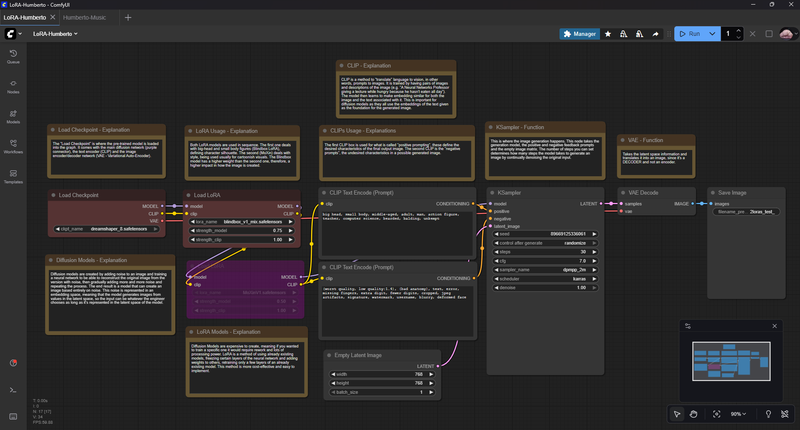
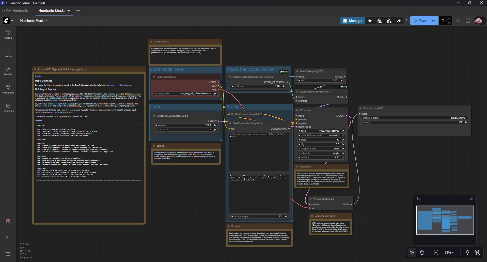

# Comfy UI Projects

## Text to Image - 

#### Diagram -

# CLIP Prompt Examples

Below are several **positive/negative CLIP prompt pairs** along with their corresponding **generated outputs**.

---

## Example 1

### **Positive Prompts**

`big head, small body, middle-aged, adult, man, action figure, bearded, balding, buff, bodybuilder, filthy`

### **Negative Prompts**

`(worst quality, low quality:1.4), (bad anatomy), text, error, missing fingers, extra digit, fewer digits, cropped, jpeg artifacts, signature, watermark, username, blurry, deformed face`

### **Output**

---

## Example 2

### **Positive Prompts**

`big head, small body, cat`

### **Negative Prompts**

`(worst quality, low quality:1.4), (bad anatomy), text, error, missing fingers, extra digit, fewer digits, cropped, jpeg artifacts, signature, watermark, username, blurry, deformed face`

### **Output**

---

## Example 3

### **Positive Prompts**

`big head, small body, cat, dog, hybrid, cartoon`

### **Negative Prompts**

`(worst quality, low quality:1.4), (bad anatomy), text, error, missing fingers, extra digit, fewer digits, cropped, jpeg artifacts, signature, watermark, username, blurry, deformed face`

### **Output**

---

## Example 4

### **Positive Prompts**

`big head, small body, boy, split in half, bloody, soccer, hooligan, field`

### **Negative Prompts**

`(worst quality, low quality:1.4), (bad anatomy), text, error, missing fingers, extra digit, fewer digits, cropped, jpeg artifacts, signature, watermark, username, blurry, deformed face`

### **Output**

---

## Example 5

### **Positive Prompts**

`big head, small body, brazilian, student, stressed, finals, test`

### **Negative Prompts**

`(worst quality, low quality:1.4), (bad anatomy), text, error, missing fingers, extra digit, fewer digits, cropped, jpeg artifacts, signature, watermark, username, blurry, deformed face`

### **Output**

---

# Text to Audio - 

## Audio Prompt Examples

Below are several **Style + Lyrics** combinations paired with their corresponding **local audio files**.

---

## Example 1

### **Style**

`sertanejo, country, south america, latin, hi hats, groove`

### **Lyrics**

`Eu estou cansado ate a alma e quero que tudo acabe o mais rapido possivel`

### **Audio File**

`docs/audio/ex1_cansado.mp3`

<audio controls>
  <source src="docs/audio/ex1_cansado.mp3" type="audio/mpeg">
  Your browser does not support the audio element.
</audio>

---

## Example 2

### **Style**

`heavy, metal, heavy metal, harsh vocals, gutteral sounds`

### **Lyrics**

`Is it actually that bad to eat silica gel? It looks so good. I'm going to eat it anyway. My tummy hurt, I regret everything`

### **Audio File**

`docs/audio/ex2_silica.mp3`

<audio controls>
  <source src="docs/audio/ex2_silica.mp3" type="audio/mpeg">
  Your browser does not support the audio element.
</audio>

---

## Example 3

### **Style**

`jazz, groove, slow, methodical, complex, soothing, smooth`

### **Lyrics**

`I am transcending reality as we speak. I want to go to the bathroom immediately, I am having a child.`

### **Audio File**

`docs/audio/ex3_child.mp3`

<audio controls>
  <source src="docs/audio/ex3_child.mp3" type="audio/mpeg">
  Your browser does not support the audio element.
</audio>

---

## Example 4

### **Style**

`groove, funk, rapid, chaotic, upbeat`

### **Lyrics**

`Eu preciso saber viver, não tenho conceito do que é a vida real e tenho medo profundo do desconhecido. Por favor, me fale que eu não tenho arrependimentos na vida. Eu não vou acreditar em você mas pelo menos vou tentar escutar.`

### **Audio File**

`docs/audio/ex4_vida.mp3`

<audio controls>
  <source src="docs/audio/ex4_vida.mp3" type="audio/mpeg">
  Your browser does not support the audio element.
</audio>

---

## Example 5

### **Style**

`drum and bass, electronic, bass, drums, hi hats, rapid, loud`

### **Lyrics**

`Eu preciso ter algum propósito na vida, mesmo que ele seja ruim, só preciso de um rumo`

### **Audio File**

`docs/audio/ex5_rumo.mp3`

<audio controls>
  <source src="docs/audio/ex5_rumo.mp3" type="audio/mpeg">
  Your browser does not support the audio element.
</audio>

